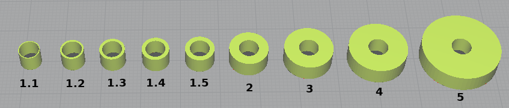

### Simple bushings for 3D printing

Bathroom fan was slipping on its axle, needed a bushing to keep it
from grinding against motor mount. The [SCAD file][scad] is designed
to allow easy adjustment of the ratio between the outer and inner
diameters of the bushing. That is, if you want a bushing where the
outer diameter is 1.7 times that of the inner diameter, you would edit
the file so `OIratio=1.7;`, render (`F6`) the file in [OpenScad][os],
and then export to STL.

You would then open the STL file in your favorite slicing program, and
scale the X/Y values to set the actual width, and the Z values to the
desired height.

I have pre-rendered a few STL files for OD/ID ratios I thought might be useful:

[scad]: GenericBushing.scad
[os]: https://www.openscad.org/downloads.html
