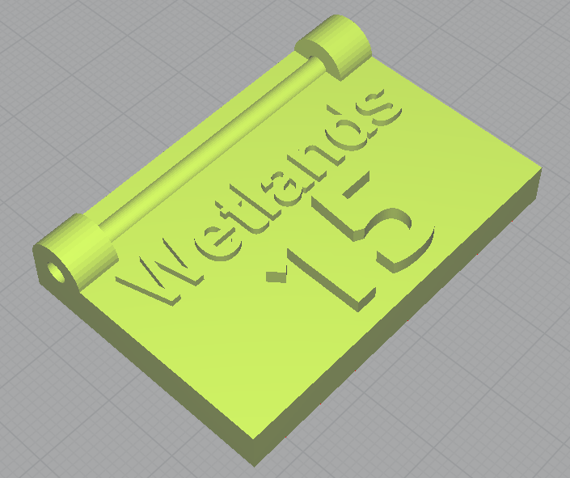

### 3D Printed Number Tags

I had a survey done of wetlands. The boundary points were marked by
the surveyor by light tape. I wanted to add more durable, numbered
markers to these. This model is a rectangular token, with loops for
attaching string, and configurable label and number text. To customize
it, open the [SCAD file][scad] with [OpenScad][os] and alter the
`label` and `number` variables as desired. You can also change the
font name and size, and configure the dimensions of the token if
desired. Use Preview (`F5`) to check your progress, and when
satisfied, render (`F6`) the file, then export it to STL and load into
your favorite slicing program to prepare for printing.

This is an example of one of the wetlands markers, rendered in Cura:

[scad]: LabeledToken.scad
[os]: https://www.openscad.org/downloads.html
